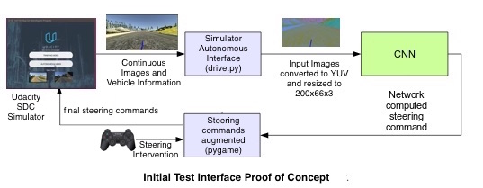
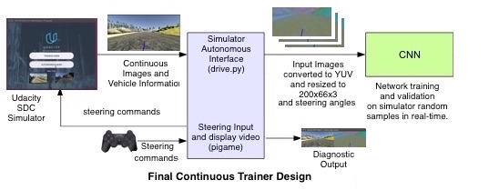
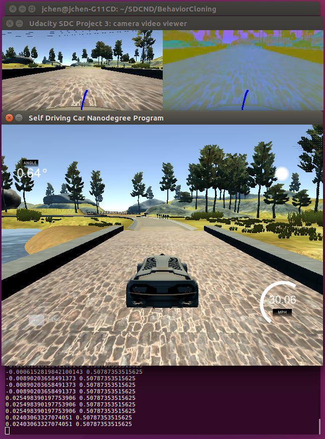

# AgileTrainer
Agile Trainer for Udacity SDC Simulator for Udacity Self-Driving Car Project 3: Behavioral Cloning

Project Goal: Use Behavioral Cloning to train a CNN model to drive a car in a simulator.

## Challenge Statement

For Project 3, Udacity has created a car simulator based on the Unity engine that uses game physics to create a close approximation to real driving.  Our task is to use the lessons we learn in the Behavioral Cloning to:

1. Collect left, center and right camera images and steering angle data by driving the simulated car
2. Design and create a CNN regression model architecture for learning the steering angle based on the center camera image
3. Train it to drive the simulated car
4. Test the trained model in the simulator in Autonomous mode.
5. Repeat 1-4 until the trained model can drive the simulated car repeatedly on Track1.
6. Additional challenge, on Track2.

## Problem Statement

Training in batch mode is tough!  Times from step 1 to 3 could take hours, before trying on the simulator in Autonomous mode and find out:

1. Data collected was not enough
2. Data collected was not the right kind
3. Key areas in the track were not learned correctly by the model
4. Model was not design or create correctly.

This leads to a very unsatisfactory experience.  The data collection, model design, training and testing cycle needs to be faster.  After going through this cycle seven times, on the eighth try, I decided to do something different.  The idea is that the design of the data collection, collecting/sampling, and then actual training loop is taking too long.  So, to shorten it, we will try an "agile" development process, where instead of an waterfall approach, we iterate more quickly with idea, design, data gathering and training in a tighter interactive loop with feedback.  

## Initial "Intervention" Validator Prototype

While looking for a way to get the training images and steering angles out faster, I found that drive.py module was the closest fit to what we need, since it was able to communicate with the Simulator and get the images and steering angles directly.  Following this reasoning, I put together an initial proof of concept.  The initial version is more of a human "intervention" validator.  Think of a self driving car that is in test that needs someone to hit the emergency stop if it goes in the wrong direction.  But in this case, we can nudge it in the right direction, so we can see how far it can keep on going at its present training. 

Think of it as training wheels for self-driving cars.  The interface is hooked up to a modified "drive.py" that augments the steering command with the a joystick controller connected to pygame module.

## Continuous Trainer

My next version is a bit more towards what I intended, an interactive trainer that the simulator feeds directly into.

Below is what a version of it looks like when running.  The generic version only has one video view since I am not sure what additional preprocessing your model will need to display on a PyGame screen.

No need for data augmentation because the data is always new.  The image and steering data is collected and cached and then feed randomly to the trainer using the model.fit_generator function.  When we find a problem area in the course using the initial joystick interface, we launch the new trainer and then just train at that trouble spot.  We can slow down at that spot and collect more samples to get it model weights corrected.  Assuming that the model is good, it should be able to correct itself after that.  If the model is bad, we can tell right away, and either provide more training, or go to another iteration of the model architecture design and abandon the current version.  In fact, using the first interface, we can test do destructive testing by nudging the car in the simulator off course, see if it can recover and recenter itself on the course.  This will let us know how robust is the model in following the course around the given track.  It sort of like a "deliberate practice" (http://expertenough.com/1423/deliberate-practice) for self-driving cars, if you will.

## Accessing the Training Tools

The training tools works in place of the drive.py module that you use previously for validating your training.  You still need drive.py for your final validation, but for repeated training and testing your should use these new modules.  "pygameJoyDriveInterface.py" is for initial testing to see where your model's key weaknesses are.  Then use "continuousTrainer.py" to correct those weaknesses by driving to those key areas and slow down to collect extra data points for your model to improve.  you may need to update these tools if your images/steering angles input requires preprocessing (YUV, resize, etc.) before they are fed into your model.  A stubbed preprocess function is provided to do this.

| Tool | Description | Needs Update? | Usage |
| :--- | :--- | :---: |  :--- |
| PS3Controller.sh | Shell script to launch PS3/XBOX controller driver | No | sudo ./PS3Controller.sh |
| pygameJoyDriveInterface.py | Initial Prototype to interface pygame, drive.py and the model | Maybe Preprocessing? | python pygameJoyDriveInterface model.json |
| continuousTrainer.py | Continuous Trainer | Maybe Preprocessing? | python continuousTrainer.py model.json |

## Additional Areas to Explore

These tools are meant to be improved.  Some ideas are:

1. Replace/Augment joystick interface with keyboard:  http://www.pygame.org/docs/ref/key.html
2. Use key/joystick button to interactively launch via thread.start() function, the trainer.
3. Use key/joystick motion to gather training data at key areas.
4. Update trainer with multiple models for re-enforment training?
   - Get a model that knows how to drive a track train a new model

## Have fun!

Feel free to fork this repository and make a different version!

